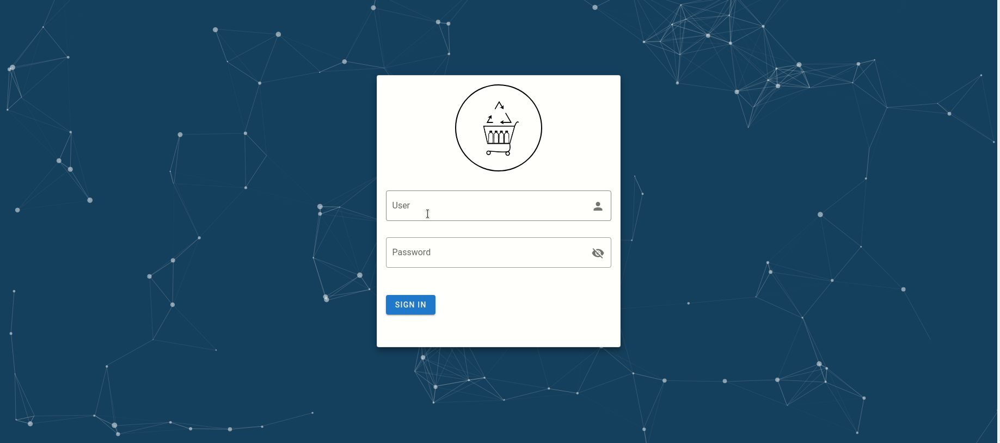

# 2DAMA_Grup6
Projecte M06-M07-M08-M09
# Sign in
En este apartado es la primera página que vas a ver, este es nuestro sign in, y solo podrá acceder personas con rol administrador, que no estén baneados, y que el usuario y contraseña coincidan con alguno de nuestro base de datos. Básicamente, el botón de sign in llama a una API que hace un select de nuestros usuarios en nuestra BBDD y nosotros validamos si existe, si es administrador, etc. En caso de hacer el login correcto podrás acceder a la siguiente página, donde verás la tabla de los usuarios con sus diferentes funcionalidades. Aquí puedes ver la página:

***
# Usuarios
Seguidamente, tendremos la página de usuarios que es una tabla con diferentes tipos de filtros y botones. Aquí muestra todos los usuarios con los campos principales, por cada usuario hay un botón que abrirá un "dialog" y mostrara la información detallada de ese usuario. Al ser una interficie solo para administradores, hay botón para banear a un usuario, siempre y cuando sea este usuario, no sea rol de administrador (No puedes banear a un administrador). En la parte posterior podrás ver dos botones, uno con forma de chat y otro con la foto del usuario logeado. El primero es un botón que abrirá una ventana emergente con todas las peticiones de cambiarse el rol de usuario a artista, para poder vender productos. Estas peticiones han sido enviadas desde la app. Y nosotros podemos denegar o aceptar. El segundo botón con nuestra imagen, es como una parte de nuestro perfil que o bien podremos editar la información de nuestro usuario o bien podremos desconectarnos y regresar a la página de signin. Ver ejemplos:

<b>Ver info de usuario</b>

<b>Editar usuario logeado y hacer logout"</b>

"En el ejemplo anterior podeis ver que en la tabla el nombre `Nose` se ha cambiado por el que he puesto en la ventana de editar."
***
# Productos
En esta página podremos ver la galería de productos, mostrando imágenes que pasando el ratón por encima (hover) aparece un botón de información para que puedas abrir un desplegable con la información de ese producto. Esta galería de productos está configurada una sola vez, es decir, que todos funcionan de la misma manera, con la única diferencia es que solo cambian las imágenes y la información. Cada producto es único y se identifica a por su id, y los productos siempre son subidos desde la aplicación móvil. Igual que en la página de usuarios, tendremos en la parte superior los dos botones de peticiones y de perfil. Y en la parte posterior de la página un botón que nos lleva a la tabla de usuarios Ver ejemplos:

